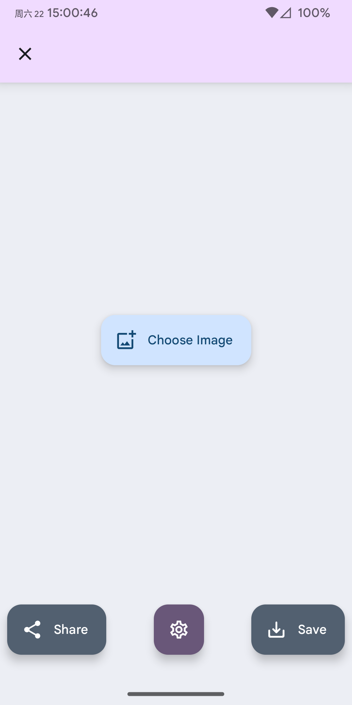
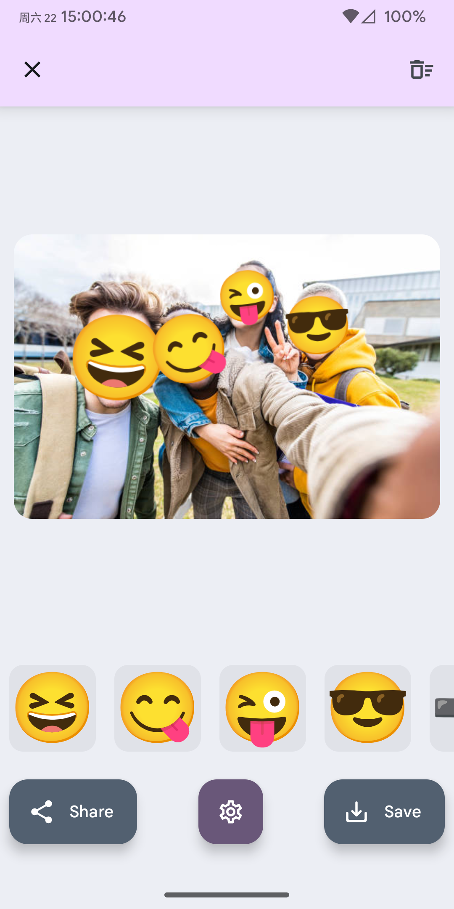

# FaceMoji

简体中文 / [English](./README-EN.md)

通过在应用选取或从其他应用分享的方式读取图片，识别图片中的人脸并以 Emoji 表情覆盖。  

## 获取

### 网页版 (Web)

无需安装，即点即用。所有处理均在本地进行，隐私安全。支持 PWA 安装。

> 部署说明：点击上方按钮可快速部署到 Vercel。如果手动部署，请确保 **Root Directory** 设置为 `web`。
> [查看 Web 版详细文档](./web/README.md)

### Android 客户端

应用提供两种 APK 版本，请根据您的使用习惯选择：  

- `default`: 安装后默认显示应用图标。可以在设置中隐藏图标，但该功能在部分安卓系统上可能无法完美生效。   
- `icon-disabled`: 安装后默认隐藏应用图标。如果主要通过其他应用的“分享”功能来使用此应用，推荐选择此版本。同时仍然可以进入应用设置取消隐藏图标。  

|||
|:-:|:-:|

## 功能

1. 自动识别图片人脸并应用预设效果
    - 默认效果为将人脸覆盖为 Emoji 表情
    - 可在设置中选择模糊效果
2. 在图片上添加、修改、删除 Emoji / 模糊区域
3. 提供高斯模糊、像素化、半色调网点（与标准定义存在一定差异）等多种模糊效果
4. 隐藏应用图标（此状态下只能通过从其他应用将图片分享到本应用的方式来启动本应用）
5. 导入自定义 Emoji 字体文件

## 注意

1. 本应用「**按原样提供**」，不附带任何形式的担保。
2. 本应用所使用的人脸识别模型存在其性能限制，某些情况下可能存在误识别/未识别的情况。
3. 本应用所有处理均**离线**进行。
4. Web 版本完全由 Jules (Vibe Coding) 生成。目前整体可用，但代码质量及稳定性不作保证。

## 鸣谢

本项目依赖与以下资源和项目：
1. 本项目使用的图标来源于 [Carnival Masks Pack](https://www.freepik.com/free-vector/carnival-masks-pack_832490.htm#fromView=search&page=1&position=25&uuid=19121ed9-3676-4304-a9af-fdd72fe1528c&query=Masquerade+mask+icon) by freepik，进行了一定修改。
2. 本项目使用 [derronqi/yolov8-face](https://github.com/derronqi/yolov8-face) 提供的预训练模型进行人脸检测。

